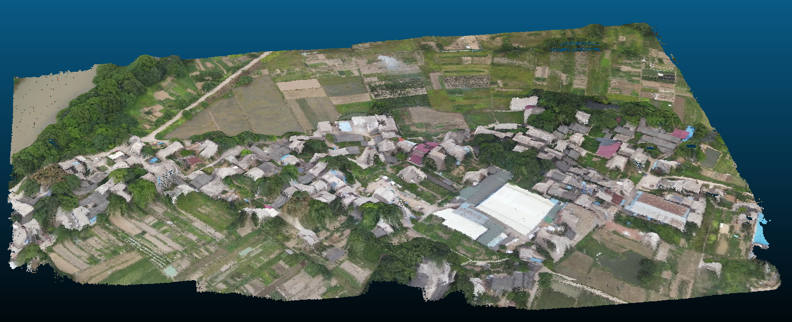
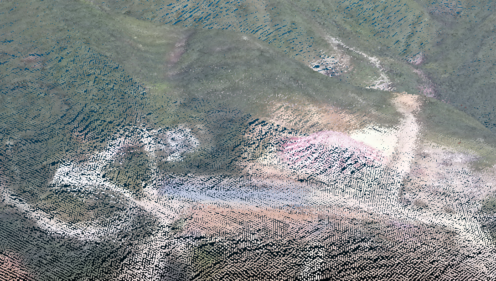
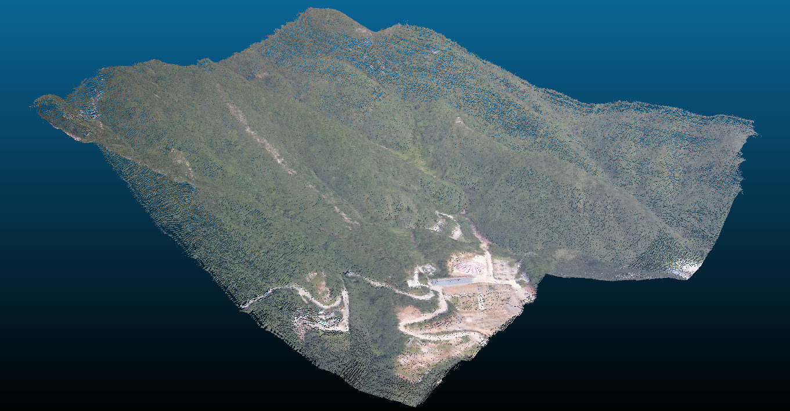

# TSDF-CUDA
A simple example for TSDF fusion.
## 1. Dependency
- OpenCV
- CUDA
- PCL

## 2. Results

 
 
 

## 3. TO DO

- [ ] Support large voxel grid size
- [ ] Voxel Hash
- [ ] Deintegration
- [ ] PCL gpu module

